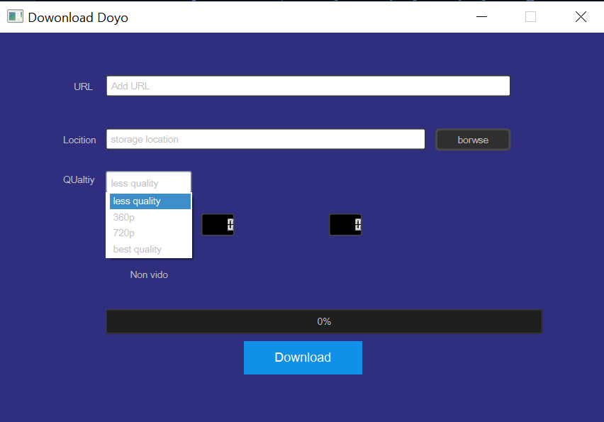

# Download-videos-YouTube-with-PySide6-and-Python
The "YouTube Video Downloader with PySide6 and Python" repository is an exciting project aimed at providing an application that allows users to download videos from YouTube easily and swiftly. The application utilizes Python programming language and PySide6 library to create a modern and user-friendly graphical interface.

